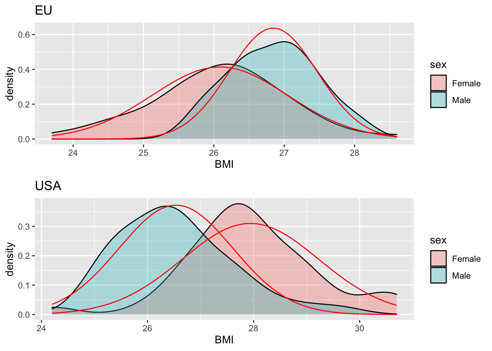

# Statistical Data Visualization with R and ggplot2

Welcome to my repository summarizing key concepts, techniques, and applications learned during the course on statistical data visualization using R and ggplot2. This repository contains my work and insights from the course on statistical data visualization. It includes exercises, term paper projects, and a final presentation, highlighting the application of R and ggplot2 for analyzing and visualizing statistical data.

---

## **Topics Covered**

### **1. Data Wrangling**
- Importing and transforming datasets using `dplyr` and `tidyverse`.
- Cleaning and combining data with joins (`inner_join`, `left_join`) and summarizing statistics.

---

### **2. Data Visualization**
#### Barplots  
- Visualizing categorical comparisons with `geom_bar` and `geom_col`.
   

#### Distributions  
- Plotting histograms, density plots, and Q-Q plots for data distribution analysis.
   

#### Regression  
- Creating scatter plots with regression lines and interpreting model results.
  
  
#### Spatial Data  
- Mapping geographical data using `geom_polygon` and `coord_map`.

---

### **3. Statistical Methods**
- Correlation analysis using Pearson's and Spearman's methods.
- Simple and multiple linear regression using `lm()`.
- Comparative analysis with boxplots and violin plots.

---

## **Practical Analysis with Term Paper: Analysis of German Population Health and COVID-19 Impact**

The term paper focused on three main questions:

### **1. Penguin Flipper Length Analysis**
- Investigated the impact of time, species, and sex on penguin flipper length using the `palmerpenguins` dataset.
- Improved visualization of data trends and performed statistical tests to determine significant effects.

**Example Output:**
[View Results](./Practical%20term%20paper/final-Q1.html)

---

### **2. Perceived Health Status in Germany**
- Explored how gender, education, and age affect the perceived health status of Germans using the `Germany_overall_health.csv` dataset.
- Visualized differences between the "old" and "new" federal states (East vs. West Germany).

**Visual Outputs:**
1. Impact of gender and education level.  
   

2. Differences across age groups and genders.  
   

3. Mapped percentages of people assessing their health as good across Germany.  
   

---

### **3. COVID-19 Incidence Rates**
- Analyzed which German states experienced the most and least days with high COVID-19 incidence rates.
- Visualized states with more than 100 and 200 cases per 100,000 inhabitants over rolling 7-day periods.

**Example Output:**


---

## **Final Project: Taiwan Bio-Industry Analysis**
This project analyzed the impact of the COVID-19 pandemic on Taiwan's bio-industry using:
- Time series analysis of the bio-stock index before and after the pandemic.
- Correlation analysis between bio-index and factors like vaccination rates, new cases, and deaths.
- Visualizations showing data trends and insights.

**Key Plots:**
1. Bio-stock index before and after COVID-19.  
2. Correlation matrix of bio-index and related factors.  

**Example Output:**  
[View Poster](./final%20project/presentation/poster.png)

**The extra Gif for the infection of Taiwan**

The plot indicatet the infection population in Taiwan over time. This is not related to my final project. But U think it's cool that use R to make a gif file.


---

## **How to Use This Repository**
1. Clone the repository:
   ```bash
   git clone https://github.com/Dewey-Wang/R-statistic.git
